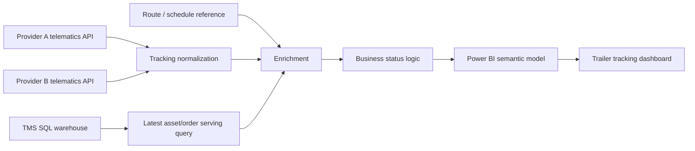
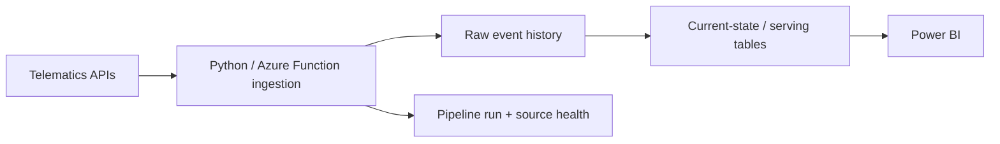

# Trailer Tracking Power BI — Public Portfolio Reconstruction

> **Public-safe portfolio version.** This repository documents the architecture, debugging, performance work, and design decisions from a real trailer-tracking Power BI project. It is a reconstruction for portfolio use, not a dump of the production report.

## Why this repository is sanitized

The production solution contained operational logistics data, third-party API credentials, customer and carrier identifiers, internal server/database names, SharePoint paths, asset/order IDs, GPS/location history, and report-specific business values. None of those belong in a public repository.

This version therefore:

- omits the production `.pbix` and all diagnostic/crash packages;
- replaces telematics vendors with **Provider A** and **Provider B**;
- replaces the production transportation-management environment with a generic **TMS warehouse**;
- replaces real server, database, customer, route, account, asset, order, carrier, and employee identifiers;
- uses synthetic sample data only;
- keeps business thresholds and financial amounts configurable or omitted;
- shows representative Power Query M and SQL patterns rather than proprietary production code.

## Project summary

The project began as an existing Power BI trailer-tracking report that combined multiple GPS/telematics sources with transportation-management data and route schedules. The immediate challenge was not just visualization: the report had to reconcile several source systems, classify operational trailer states, remain understandable to users, and refresh without placing unnecessary load on shared systems.

I worked through the project in several stages:

1. **Reverse-engineer the existing report** — document queries, field meanings, status logic, refresh behavior, and user-facing definitions.
2. **Standardize tracking inputs** — normalize two telematics providers into a common schema and preserve a stable report contract.
3. **Rework enrichment logic** — match tracking state to the latest relevant TMS order and route/schedule information.
4. **Fix correctness issues** — deterministic latest-record selection, asset-key cleanup, duration semantics, missing/stale references, and source-specific differences.
5. **Investigate SQL/Power Query load** — identify an expensive historical/as-of lookup pattern and move “latest per asset” work closer to the SQL source.
6. **Profile the API path** — compare Power Query API pagination with a Python implementation and isolate transfer/evaluation overhead.
7. **Optimize Power Query** — add compression, buffer individual responses within an evaluation, collect raw pages first, and reduce to the latest record once.
8. **Improve dashboard usability** — organize the report around clearer KPIs, filters, table states, buttons, and user-facing descriptions/tooltips.
9. **Define the long-term architecture** — move API ingestion out of the PBIX into a persistent ingestion/serving layer so Power BI becomes a consumer rather than the ingestion engine.

## High-level architecture



The production dashboard used a common tracking contract similar to:

| Field | Purpose |
|---|---|
| Asset ID | Normalized trailer/asset key |
| Location | Current city/state style display |
| Landmark | Current known landmark/hub |
| Status | Moving/stopped style motion status |
| Speed | Latest reported speed |
| Duration in current status | Time in current motion state |
| Duration [h] | Numeric status duration for rules |
| Idle [h] | Numeric idle/stopped duration used by exception logic |
| Event Date | Latest tracking event timestamp |
| Fleet | Source/provider marker |

## Operational classifications

The report translated raw tracking + TMS data into user-facing operational states. The public version intentionally omits production thresholds, route aliases, and fee values, but the categories included concepts such as:

- **OK** — within the expected return window or at an approved hub.
- **Delayed** — beyond the calculated expected return date.
- **Abandon** — idle beyond a configured threshold away from approved hubs.
- **Not Tracking** — tracking behavior indicates stale or unreliable current-state data.
- **Out of Network** — no matching current/relevant TMS order was available.
- **Exclusion** — intentionally excluded from the main exception categories.

See [`docs/business-logic.md`](docs/business-logic.md).

## The main performance problem

The original report treated the TMS query as a large historical lookup table. At tracking-row level, Power Query nested/filter-sorted historical order/stop rows to find the most recent eligible record. As history grew, that design caused more SQL work, more transferred rows, repeated local scans/sorts, and higher Power Query memory/evaluation cost.

A second bottleneck was API ingestion. One telematics source required sequential pagination. In Power Query, the initial version also converted/cleaned/grouped every page and then grouped the combined result again.

## What changed

### SQL/TMS side

- reduced the TMS query to the minimum report-facing columns;
- resolved **latest relevant order per asset** server-side instead of repeatedly scanning stop-level history in Power Query;
- normalized join keys once;
- joined wider movement/payee detail only after the asset/order candidate set had already been reduced;
- treated the TMS source as a serving query instead of a historical database embedded in the PBIX.

### Power Query/API side

- kept pagination sequential because the next cursor depended on the prior response;
- requested compressed responses with `Accept-Encoding: gzip`;
- buffered each response binary inside the current evaluation;
- buffered the generated page list inside the current evaluation;
- collected raw page lists first;
- performed `Table.FromRecords` once;
- cleaned dates/keys once;
- reduced to latest event per asset once globally instead of once per page plus once again globally;
- kept helper queries as staging-only where possible instead of loading them into the model.

A sanitized example is in [`power-query/provider_a_tracking.m`](power-query/provider_a_tracking.m).

## Observed Power Query benchmark progression

These were controlled **Refresh Preview** observations during development, not laboratory benchmarks. The API used a rolling time window, so row counts and network conditions varied between runs.

| Test | Observed time |
|---|---:|
| Original Power Query implementation | ~9:00 |
| Binary/list buffering | 8:09 |
| Buffering + gzip | 4:50 |
| Buffering + gzip + one global reduction | **3:40** |

That is an observed reduction of roughly **59%** from the original ~9-minute run to the 3:40 run. A separate “HTTP-floor” test took ~4:30, which demonstrated enough run-to-run variability that it should **not** be used to calculate an exact transformation cost.

See [`benchmarks/README.md`](benchmarks/README.md).

## What I learned from the performance work

The most useful principle was not “make Power Query cleverer.” It was **do less work, fewer times, at the correct layer**:

- narrow the data before moving it;
- keep the grain explicit;
- reduce to the current/latest state once;
- avoid historical row multiplication when the report only needs current state;
- do set-based work in SQL when SQL already owns the data;
- treat API transfer and pagination as a separate performance problem from report transformations;
- benchmark end-to-end changes rather than assuming a micro-optimization helped.

This mindset was influenced by the One Billion Row Challenge and community discussions around Power BI and agile data modeling. I did **not** copy a Java implementation into Power Query; I adapted the general ideas of reducing work, minimizing repeated passes, using compact intermediate structures, and measuring wall-clock behavior.

## Long-term goal

The long-term architecture moves ingestion out of Power BI:



The target design includes:

- incremental API pulls with an overlap/watermark;
- persistent raw history and latest-known current state;
- event deduplication;
- retry/backoff and source-health monitoring;
- last-good data retained during provider outages;
- SQL serving objects shaped specifically for Power BI;
- Power BI refreshing a small current-state dataset rather than repeatedly downloading an entire tracking window.

That makes the BI report more stable, auditable, and scalable while reducing dependency on Power Query as an ingestion engine.

## Repository contents

```text
.
├── README.md
├── SECURITY.md
├── .gitignore
├── assets/
│   └── README.md
├── benchmarks/
│   ├── README.md
│   └── power-query-refresh-benchmarks.csv
├── docs/
│   ├── architecture.md
│   ├── business-logic.md
│   ├── optimization-notes.md
│   ├── project-history.md
│   ├── resources.md
│   ├── roadmap.md
│   └── sanitization-checklist.md
├── power-query/
│   ├── provider_a_tracking.m
│   └── new_traffic_structure.m
├── samples/
│   ├── route_schedule_sample.csv
│   └── tracking_sample.csv
├── scripts/
│   └── public_repo_check.py
└── sql/
    └── latest_asset_order.sql
```

## Tools and technologies

- Microsoft Power BI Desktop
- Power Query M
- SQL Server / Azure SQL concepts
- REST/JSON API ingestion
- SharePoint/Excel reference data
- Python (used as a comparison and as the long-term ingestion direction)
- Figma/SVG assets for dashboard redesign work

## Research and references

See [`docs/resources.md`](docs/resources.md). Key resources included:

- Agile data modeling community: https://www.reddit.com/r/agiledatamodeling/
- Power BI community: https://www.reddit.com/r/PowerBI/
- The One Billion Row Challenge: https://github.com/gunnarmorling/1brc
- Microsoft Power Query best practices and query-evaluation guidance.
