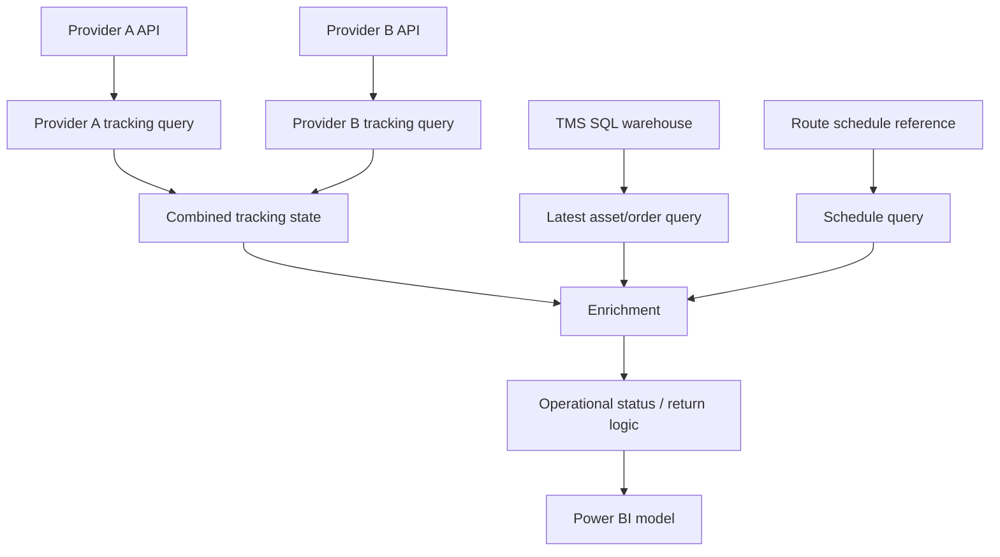
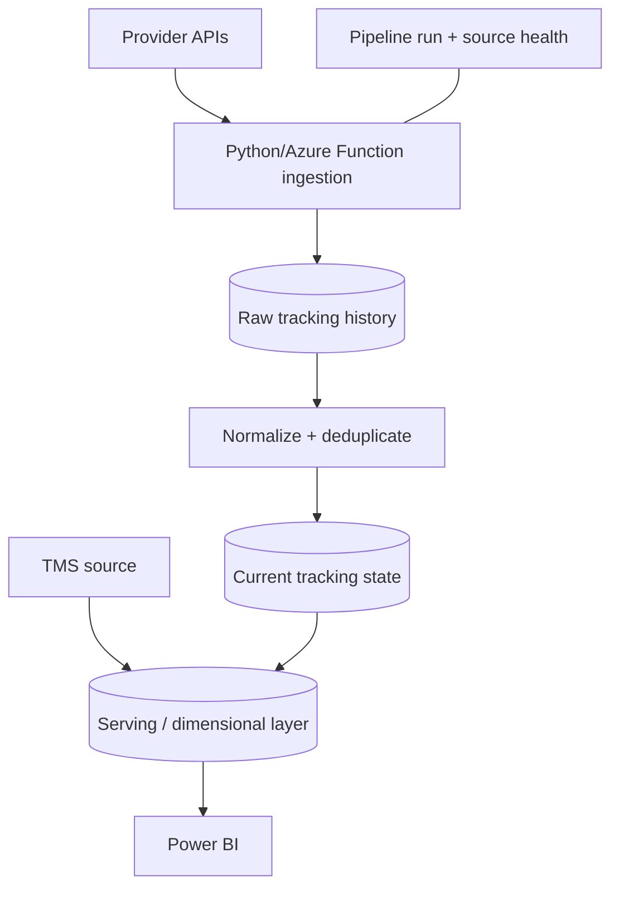

# Architecture

## Current Power BI-centered architecture



### Design contracts

**Tracking source contract**

- one logical latest row per asset after reduction;
- normalized asset key;
- source/provider marker;
- numeric durations available for downstream rules;
- event timestamp suitable for recency checks.

**TMS serving contract**

- one latest/relevant order row per asset;
- only report-needed identifiers and timestamps;
- wider carrier/movement context joined after the asset candidate set is reduced.

**Schedule contract**

- normalized trip key;
- lane/origin context;
- distance/drive-time attributes needed for expected-return logic.

## Why “grain” mattered

The original TMS source was effectively at stop/history grain while the report needed current asset grain. Joining those grains without reduction caused row multiplication and forced the BI layer to repeatedly answer a question SQL could answer once: “what is the latest relevant TMS record for this asset?”

The optimized design reduces each source to its intended reporting grain before expensive downstream enrichment.

## Query load configuration

In the production pattern, helper/staging queries should have load disabled when nothing in the model uses them directly. Only model-facing entities should load.

Conceptually:

```text
TMS latest-order helper      Load OFF
Schedule helper              Load OFF
Provider A tracking helper   Load OFF
Provider B tracking helper   Load OFF
Final tracking entity        Load ON
```

This does not turn helper queries into a global cache; it simply avoids loading unnecessary copies into the model.

## Long-term architecture



Benefits:

- API calls happen independently of report refreshes;
- incremental ingestion replaces repeated rolling-window downloads;
- source outages can preserve last-good current state;
- raw history remains auditable;
- current state can include freshness/age metrics;
- Power BI reads a small serving layer.
